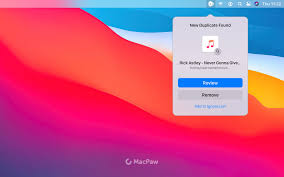

# TNW Site

A responsive static landing page inspired by The Next Web (TNW). The project recreates a news-style homepage experience with mobile and desktop navigation, featured story cards, a latest funding section, and a branded footer.

## Overview

TNW Site is built with plain HTML and CSS. It focuses on responsive layout, visual hierarchy, image-led story cards, and a funding-round section modeled after TNW-style editorial pages.

The site currently includes:

- Mobile header with logo, search icon, menu icon, and announcement banner.
- Desktop navigation with primary and secondary link groups.
- Featured story grid with image backgrounds, overlays, article metadata, and responsive layout changes.
- Latest funding section with company cards, funding amounts, categories, investors, and source labels.
- Footer with social links, site links, copyright text, and TNW branding.
- Floating accessibility buttons styled with Font Awesome icons.

## Project Structure

```text
.
|-- index.html
|-- styles.css
|-- README.md
|-- Swisscode.webp
|-- Image/
|   |-- AI-security.png
|   |-- Opal-cut.jpg
|   |-- Security.webp
|   |-- detect.jpg
|   |-- logo.png
|   |-- phone holding.jpg
|   `-- tnw-logo.svg
|-- assets/
|   `-- tnw-logo.svg
`-- github/
    `-- workflows/
        `-- linters.yml
```

## Technologies Used

- HTML5
- CSS3
- CSS Grid and Flexbox
- Responsive media queries
- Font Awesome icons loaded from CDN
- GitHub Actions linting configuration

## Visual Assets

The project includes the following image and logo assets:

### Logos

[TNW logo - Image folder](Image/tnw-logo.svg)


[TNW logo - Assets folder](assets/tnw-logo.svg)


[Site logo](Image/logo.png)


### Pictures

[Opal article image](Image/Opal-cut.jpg)


[AI security article image](Image/AI-security.png)


[Duplicate file detection image](Image/detect.jpg)



[Security image](Image/Security.webp)


[Phone holding image](Image/phone%20holding.jpg)


[SwissDeCode logo/image](Swisscode.webp)


## Getting Started

No build step is required. This is a static site.

To view the project locally:

1. Clone or download the repository.
2. Open `index.html` in a browser.

## Quality Checks

The repository includes a linting workflow at `github/workflows/linters.yml`.

The workflow defines checks for:

- Lighthouse
- Webhint
- Stylelint
- Accidental `node_modules/` commits

Note: GitHub Actions normally expects workflow files inside `.github/workflows/`. If this project should run checks automatically on pull requests, move or mirror `github/workflows/linters.yml` to `.github/workflows/linters.yml`.

## Current Status

The project currently has a complete static page structure with responsive styling and image assets. The main page is implemented in `index.html`, with all styling handled in `styles.css`.

Recent work represented in the repository includes:

- Responsive mobile and desktop header layouts.
- Hero/highlight article sections using background images and gradient overlays.
- Latest funding cards for Ringover, SwissDeCode, Klook, and Wolt.
- Responsive funding grid that expands from one column to three and four columns at larger breakpoints.
- Footer with social navigation and brand/copyright area.
- Linter workflow configuration for HTML, CSS, Lighthouse, and repository hygiene.

## Development Notes

- Keep image paths consistent with the existing `Image/` and `assets/` folders.
- Keep the site usable without a JavaScript build process unless the project intentionally changes direction.
- When adding new pages or sections, update this README so the project documentation stays aligned with the site.
- If package-based tooling is introduced later, add setup, install, and script instructions here.

